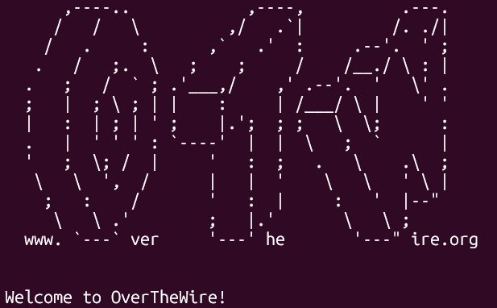

# OverTheWire Bandit

# Level 0

### 문제 정보
- **목표**: SSH를 사용해 게임 서버에 접속하기. 호스트는 bandit.labs.overthewire.org, 포트는 2220, 사용자 이름과 비밀번호는 모두 bandit0

### 풀이 과정

#### 1. 상황 파악
SSH를 사용해 원격 서버에 접속해야 하는 문제. 2220 포트를 사용해야 한다.

#### 2. 시행착오
처음 접속 시 호스트 인증 관련 메시지가 나와서 에러인 줄 알았으나, 처음 접속하는 서버일 때 나오는 정상적인 확인 절차였다.

```bash
The authenticity of host '[bandit.labs.overthewire.org]:2220' can't be established.
Are you sure you want to continue connecting (yes/no/[fingerprint])?
```

에러가 아니었고 `yes`를 입력하면 정상적으로 접속이 진행된다.

#### 3. 해결

fingerprint 확인에 yes 입력 후, 비밀번호 bandit0 입력하여 접속 성공

